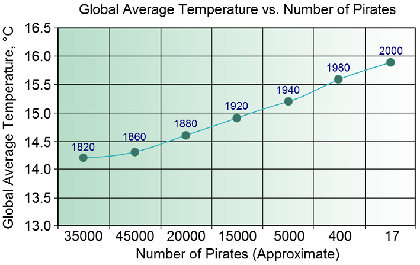
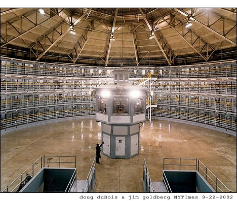
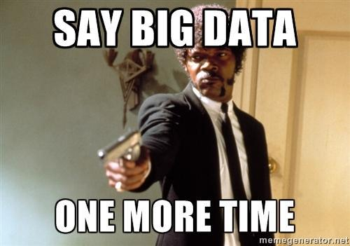

## Introduction

- Why does causality matter for policy making?
- Why do we like experiments?
- Why do we hate experiments?
- Turning a weakness into a strength
- What does policy analysis look like in the real world?


## Causality Matters



## But it's not everything

- Decisions have to be made with best evidence available
- 

## Experiments, Yay!


## Experiments, Boo!


## John Conway's Game of Life

> - Simple rules in large systems create emergent properties that are complex 
and unpredictable
> - A simple example is John Conway's Game of Life, played on a two-dimensional 
grid
> - Any live cell with fewer than two neighbors dies
> - Any live cell with two or three neighbors lives
> - Any live cell with more than three live neighbors dies
> - Any dead cell with exactly three live neighbors becomes a live cell
> - These simple patterns result in emergent patterns that stabilize in 
unpredictable but orderly ways

```{r, echo=FALSE, results='hide', message=FALSE, eval=FALSE}
library(caTools)
# The game.of.life() function ------------------
# Arguments:
# side - side of the game of life arena (matrix)
# steps - number of animation steps
# filename - name of the animated gif file
 
game.of.life <- function(side, steps, filename){
   
  # the sideXside matrix, filled up with binomially
  # distributed individuals
  X <- matrix(nrow=side, ncol=side)
  X[] <- rbinom(side^2,1,0.4)
   
  # array that stores all of the simulation steps
  # (so that it can be exported as a gif)
  storage <- array(0, c(side, side, steps))
 
  # the simulation                                             
  for (i in 1:steps)
  {
     # make the shifted copies of the original array
     allW = cbind( rep(0,side) , X[,-side] )
     allNW = rbind(rep(0,side),cbind(rep(0,side-1),X[-side,-side]))
     allN = rbind(rep(0,side),X[-side,])
     allNE = rbind(rep(0,side),cbind(X[-side,-1],rep(0,side-1)))
     allE = cbind(X[,-1],rep(0,side))
     allSE = rbind(cbind(X[-1,-1],rep(0,side-1)),rep(0,side))
     allS = rbind(X[-1,],rep(0,side))
     allSW = rbind(cbind(rep(0,side-1),X[-1,-side]),rep(0,side))
      
     # summation of the matrices
     X2 <- allW + allNW + allN + allNE + allE + allSE + allS + allSW
      
     # the rules of GoL are applied using logical subscripting
     X3 <- X
     X3[X==0 & X2==3] <- 1
     X3[X==1 & X2<2] <- 0
     X3[X==1 & X2>3] <- 0
     X <- X3
      
     # each simulation step is stored
     storage[,,i] <- X2
     # note that I am storing the array of Ni values -
     # - this is in order to make the animation prettier
   }
    
   storage <- storage/max(storage) # scaling the results
                                   # to a 0-1 scale
 
   # writing the results into an animated gif
   write.gif(storage, filename, col="jet", delay=5)
}
 
game.of.life(side=450, steps=300, file="assets/conway.gif")

# http://www.r-bloggers.com/fast-conways-game-of-life-in-r/ 
gc()
```

## Results


## Policy is Not Unlike This

- Start with simple rules
- Add more simple rules
- Regulated entities react to these rules
- Observe emergent properties
- Repeat

## Quasi-Experiment Examples in the Wild

- Regression discontinuity through ELL reclassification
- Fixed effects regression through BLBC program offer
- Propensity score matching for pre-college scholarship programs
- Differences in differences evaluation of community learning centers (CLCs)


## Why? Linked Administrative Systems




## Why? Big Data




## How does it work?

## Caveats

## Come work for DPI


