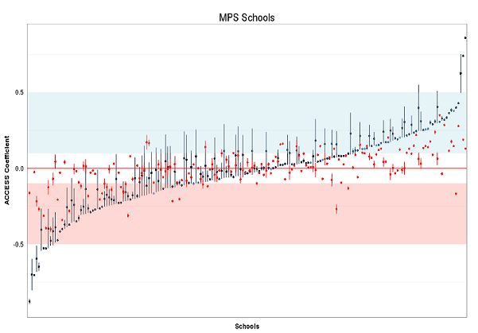
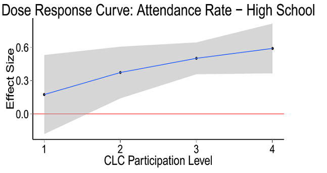
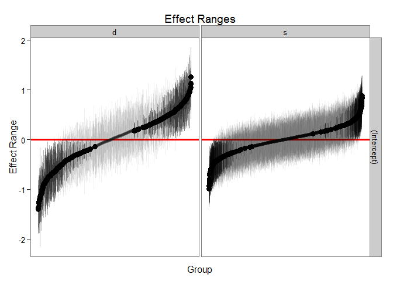
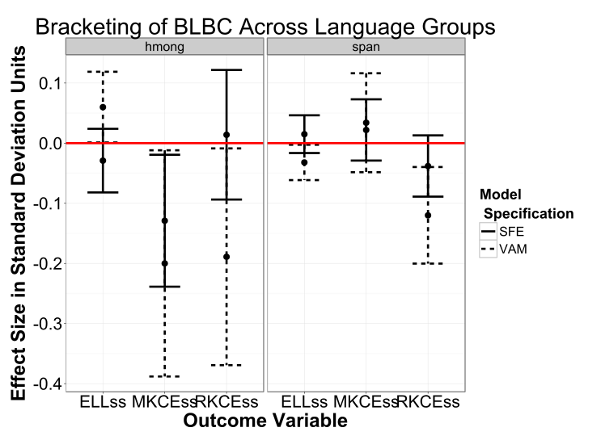

## Introduction

- Why does causality matter for policy making?
- Why do we like experiments?
- Why do we hate experiments?
- What quasi-experimental alternatives do we have available?
- What does policy analysis look like in the real world?

## Avoid the spurious


- Politics has a way of trying to making spurious bivariate correlations seem 
important

## Experiments, Yay! {.flexbox .vcenter}

<div class="centered">

</div>

## The experiment is the "gold" standard

- The "experiment" has been around since the 8th century when it was believed 
to be pioneered by Abu Mūsā Jābir ibn Hayyān (known as Geber)
- He was of course trying to manufacture gold from other metals
- The advantage was that repeating the same process on the same materials 
resulted in the same outcome, time and time again
- Even with primitive measurements and primitive understandings of the underlying 
chemical processes progress could still be made thanks to repeatability

## Experiments do...

- Provide solid internal reliability when done well
- Provide idealized estimates of impact
- Often test interventions in a best-case scenario
- Provide clean data with transparent analyses to draw conclusions

## Experiments, Boo! {.flexbox .vcenter}

<div class="centered">

</div>

## How social policy differs from rocks

- We can rarely isolate the effect we want to manipulate in isolation
- Even when we can, the isolated environment we create is rarely a sufficient 
proxy for the other contexts the intervention will be used in
- Often ignore the importance of precise implementation and often fail to 
measure the variability in implementation that will occur. 
- Do not help understand the reasons program attrition might occur
- Are limited in their ability to test the variability in response to treatment 
under different conditions -- recruiting and retaining subjects is \$\$

## Causality is good, but...

- Decisions have to be made with best evidence available
- Ruling out alternative explanations generally comes with increased costs
- Scientific process downplays the subjective judgments of domain experts in 
favor of more expensive objective measurement
- The principal of repeatability that underlies the logic of the experiment is 
not necessarily true in an evolving social structure

## An Aside on the policy process

- Think about a crude model of the policy process as existing of individual 
units governed by a few simple overlapping rules (regulations)
- Over time individuals respond to those rules, change their behavior, and 
interact with one another
- This creates an emergent equilibrium that is often unpredictable as individual 
actors seek to work within the regulations to maximize their own objectives
- A simple mathematical model illustrates how complex even a very simple system 
can be

## John Conway's Game of Life

> - Any live cell with fewer than two neighbors dies
> - Any live cell with two or three neighbors lives
> - Any live cell with more than three live neighbors dies
> - Any dead cell with exactly three live neighbors becomes a live cell

```{r, echo=FALSE, results='hide', message=FALSE, eval=FALSE}
library(caTools)
# The game.of.life() function ------------------
# Arguments:
# side - side of the game of life arena (matrix)
# steps - number of animation steps
# filename - name of the animated gif file
 
game.of.life <- function(side, steps, filename){
   
  # the sideXside matrix, filled up with binomially
  # distributed individuals
  X <- matrix(nrow=side, ncol=side)
  X[] <- rbinom(side^2,1,0.4)
   
  # array that stores all of the simulation steps
  # (so that it can be exported as a gif)
  storage <- array(0, c(side, side, steps))
 
  # the simulation                                             
  for (i in 1:steps)
  {
     # make the shifted copies of the original array
     allW = cbind( rep(0,side) , X[,-side] )
     allNW = rbind(rep(0,side),cbind(rep(0,side-1),X[-side,-side]))
     allN = rbind(rep(0,side),X[-side,])
     allNE = rbind(rep(0,side),cbind(X[-side,-1],rep(0,side-1)))
     allE = cbind(X[,-1],rep(0,side))
     allSE = rbind(cbind(X[-1,-1],rep(0,side-1)),rep(0,side))
     allS = rbind(X[-1,],rep(0,side))
     allSW = rbind(cbind(rep(0,side-1),X[-1,-side]),rep(0,side))
      
     # summation of the matrices
     X2 <- allW + allNW + allN + allNE + allE + allSE + allS + allSW
      
     # the rules of GoL are applied using logical subscripting
     X3 <- X
     X3[X==0 & X2==3] <- 1
     X3[X==1 & X2<2] <- 0
     X3[X==1 & X2>3] <- 0
     X <- X3
      
     # each simulation step is stored
     storage[,,i] <- X2
     # note that I am storing the array of Ni values -
     # - this is in order to make the animation prettier
   }
    
   storage <- storage/max(storage) # scaling the results
                                   # to a 0-1 scale
 
   # writing the results into an animated gif
   write.gif(storage, filename, col="jet", delay=5)
}
 
game.of.life(side=450, steps=300, file="assets/conway.gif")

# http://www.r-bloggers.com/fast-conways-game-of-life-in-r/ 
gc()
```

## Game of Life {.flexbox .vcenter}

<div class="centered">

</div>

## Policy is even more complex

- Start with simple rules
- Regulated entities react to these rules
- Observe emergent properties
- Add more simple rules
- New patterns emerge
- Repeat in multiple dimensions simultaneously

The resulting emergent properties are **extremely** difficult to predict. 

## A thought experiment in education

- Consider education policy for a moment
- An experiment done in 10 school districts statewide to improve reading
scores for 5th grade students in reading with a sample of almost 4,000 students
- The intervention is a 6 week reading program focused on badgers and balloons
- The program randomly assigned students to receive the treatment, or to receive 
their regular classroom instruction
- The treatment group shows positive effects that are statistically significant

## What are some threats to external validity here?

> - How were the schools selected to participate?
> - What staff were chosen to implement the policy?
> - What other policies are in place in the treatment communities? 
> - What measurements were used to assess reading progress? 
> - How big is the reading gain compared to the control group?
> - What is the control group?


## The role of experiments in policy

- A randomized controlled trial (RCT) in policy is rarely possible (and rarely 
desirable?)
- RCTs require a level of control and authority that regulators rarely 
possess
- RCTs take time and are especially difficult for long-running programs and 
long-term outcomes - *often the most interesting*
- RCTs require a level of monitoring and tracking that may not be appropriate 
for a governmental entity
- Recruiting and retaining subjects is expensive and can substantially add to the 
bill of a policy
- Lack of external validity makes it hard to say "Program X worked in the trial, 
let's go to scale."

## So now what?

<iframe src="http://giphy.com/embed/33iqmp5ATXT5m" width="480" height="204" frameBorder="0" class="giphy-embed" allowFullScreen></iframe><p><a href="http://giphy.com/gifs/sad-depressed-disappointed-33iqmp5ATXT5m">via GIPHY</a></p>

## Alternative?

Quasi-experimental methods

<iframe src="http://giphy.com/embed/2CcKiHPDsJqVi" width="480" height="410" frameBorder="0" class="giphy-embed" allowFullScreen></iframe><p><a href="http://giphy.com/gifs/stephen-colbert-finger-guns-television-2CcKiHPDsJqVi">via GIPHY</a></p>

## How to spot the opportunity?

- Pilots and phase-ins
- Budget cuts and phase-outs
- Policy resistance
- Policy shifts due to elections (changing priorities)
- Philanthropy
- Local innovation
- Natural experiments (boundary changes, closures, etc.)

## Design vs. Serendipity

- Sometimes we have the privilege of designing an quasi-experimental evaluation 
into a public policy
- Most of the time we have the joy of trying to find a quasi-experimental hook 
to retrospectively evaluate an existing program
- Designed evaluation is preferable, but the sell can be hard
- Retrospective evaluation may not always be possible or only the least rigorous 
methods may apply


## Why? Linked administrative systems {.flexbox .vcenter}

<div class="centered">

</div>

## Why? Longitudinal records {.flexbox .vcenter}

- If we record everything, we can use "instant replay"" to evaluate policy changes 
retrospectively

```{r, echo=FALSE, message=FALSE, warning=FALSE}
library(eeptools)
x <- seq(as.Date("2000/1/1"), as.Date("2016/1/1"), "months")
x1 <- seq(1:length(x))
x1[x1 > 48 & x1 < 170] <- x1[x1 > 52 & x1 < 120] + rnorm(length(x1[x1 > 52 & x1 < 120]), -30, 1)
x1 <- log(x1)
y <- 100 + rnorm(length(x1), 5, 0.2) * x1 + rnorm(length(x1), 1, 2)

qplot(x, y) + theme_dpi() + geom_smooth() + geom_line(alpha = 0.4) + 
  geom_vline(xintercept = as.numeric(as.Date("2004-04-01"))) + 
  geom_vline(xintercept = as.numeric(as.Date("2013-04-01")))+
  labs(x = "Year", y = "Scores", 
       title = "Example Longitudinal Series of Ratings")

```

## Why? Big Data {.flexbox .vcenter}

<div class="centered">

</div>

## Summary: Strength of administrative records

- Big sample size
- Good chance for pre- and post-tests
- Broad coverage of local innovation and ability to measure and track changes in the regulatory environment
- No need to plan for a specific control group because all groups have tracked outcomes
- Lots of contextual data to evaluate variability in program success across an 
array of implementation contexts


## Limitations: Measures {.flexbox .vcenter}

We are stuck with the measurements we already have which may be outdated or 
a poor fit.

<div class="centered">

</div>

## Limitations: Unobservables and Selection Bias

- The mechanism by which a program starts up may be based on non-repeatable local 
factors that are not observed
- Successful programs may be more likely to start in places where they can be 
successful
- Cannot often go back and figure out why program happened
- Little implementation data, if any exists


## Quasi-Experiment Examples in the Wild

- Regression discontinuity through ELL reclassification
- Lottery for pre-college scholarship programs
- Differences in differences evaluation of community learning centers (CLCs)
- Reverse program evaluation of achievement gap

## ELL Reclassification

- Most states move English language learning students out of ELL services after 
they score a certain score on a standardized test
- The cutpoint in the test score is arbitrary (though test is sensitive around 
this range)
- Students who just miss are identical to students who barely pass
- Use this "randomization" to evaluate the effect of leaving ELL services
- Leaving ELL services produces negative effect
- Cannot generalize this to a broad population, very narrow policy question, 
tied to specific test threshold

## Example {.flexbox .vcenter}

<div class="centered">

</div>

## Pre-college Scholarship Lottery

- Compare outcomes of students who were denied access to pre-college scholarship 
program due to oversubscription to students who attend program
- Able to compare years in program as students reapply
- Need to be sure access is random -- employ checks for randomness in denials

## Difference in Differences in Community Learning Centers

- Look at performance of students in cohort before CLC available and cohort 
after
- Same school, different cohort of pupils
- Across 100 different school sites
- Control group spread evenly across years (due to variation in program start)
- Treatment group spread evenly across years

## Results {.flexbox .vcenter}

<div class="centered">

</div>

## Identifying Gap Closing Schools

- Sometimes we can precisely measure the results we want, but did not collect 
data on the inputs driving those results
- In Wisconsin we can do a good job of measuring which schools are closing the 
achievement gap using multilevel longitudinal growth models
- The problem is we don't know what these schools did
- The solution -- use a mixed methods approach and identify outlier schools, 
gap growers and gap closers, and interview/survey/observe them around their 
practices

## Promoting Excellence For All

- DPI led taskforce that investigated practices in successful gap-closing schools

<div class="centered">

</div>

## Caveats

- Large datasets *can* work against you by giving false precision to estimates 
due to large sample size
- Large datasets *can* make robust techniques of estimating errors trickier such as 
Bayesian estimation, simulation, and model visualization
- All the caveats about selection on unobservables apply. Content expertise will 
help you evaluate how credible of a validity threat this provides.
- Need to focus on substantive impact and broad estimates of benefits recognizing 
that statistical error does not account for all the uncertainty inherent in an 
evaluation

## Come work for DPI

- DPI was recently awarded a four year data use grant that includes a substantial 
research and evaluation component
- Will be hiring a research analyst and a program manager in Q1 of next year
- Both positions will play a substantial role in evaluating policies, practices, 
and interventions associated with reducing the achievement gap, and more importantly, 
identifying how to disseminate this information more effectively to the field
- Keep your eyes on [www.wisc.jobs](www.wisc.jobs)
- If you have questions, contact me directly:
[jared.knowles@dpi.wi.gov](mailto:jared.knowles@dpi.wi.gov)


## Wisconsin Bilingual Bicultural Program

- Look at a number of models of program effectiveness using student records
- Look at performance of students who switch in and out of BLBC due to program 
start and stop 
- Look at performance of students who move between schools with and without 
BLBC programs
- Compare results across different evaluation methods

## Results {.flexbox .vcenter}

<div class="centered">

</div>
